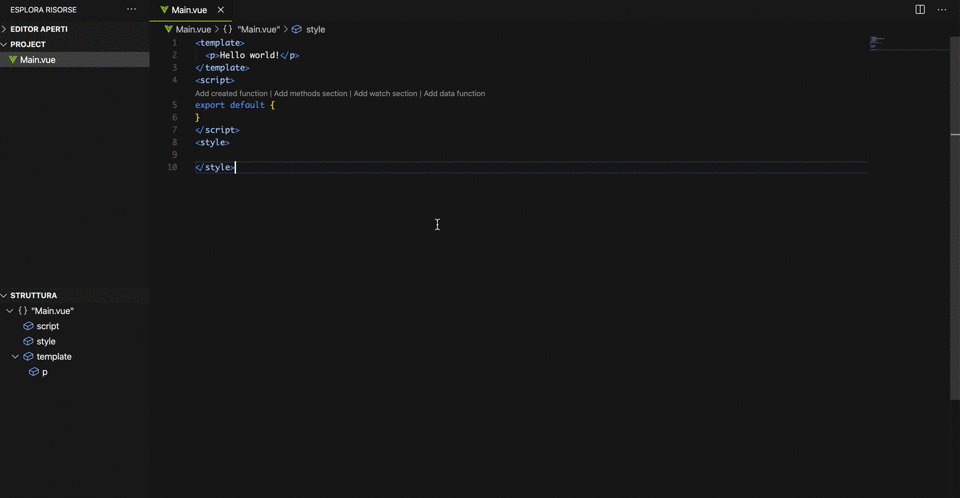
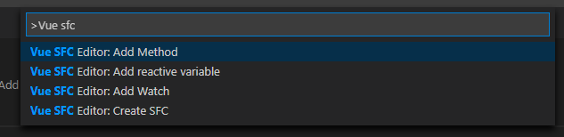
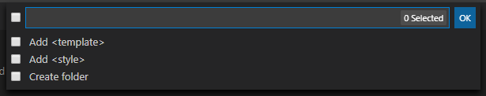
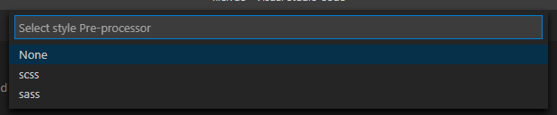
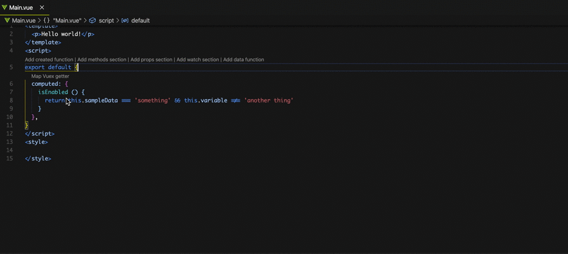
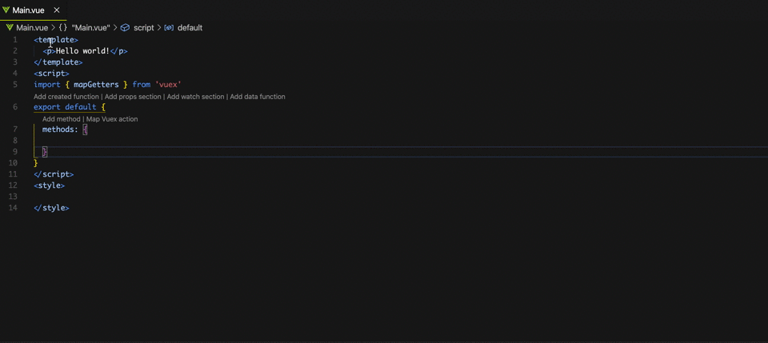

# VueJS Helper

This extension allows a quick development when using VueJS. 

You can find extension at this link https://marketplace.visualstudio.com/items?itemName=AttilioCapocchiani.vuejs-helper

Source code is open source and can be found at this link https://github.com/AttilioCapocchiani/vuejs-vscode-helper

Included commands are the following 

- Add Method: allows to easily create a new function inside the `methods` section. If `methods` section does not exist, it will be created.
- Add reactive variable: allows to easily create a new variable inside the `data` function. If `data` function does not exist, it will be created.
- Add props: allows to easily create a new `prop` asking for:
    - Prop name
    - Allowed type(s)
    - Default value
    - Whether if the prop should be required or not
- Add Watch: allows to easily create a new function inside the `watch` section. If `watch` section does not exist, it will be created.
- Create SFC: starts a wizard to create a Single File Component, asking for:
    - Component name
    - Whether to add `template` tag, `style` tag and if it should be included in a separate folder. If `style` tag is selected, the user will be prompted to choose a pre-processor too
    
    

## Vuex
This extension allows also to quickly map your Vuex actions/getters in your component! Use the actions on `computed` or `methods`. It also supports namespaced Vuex modules

### Demo

## TypeScript
This extension also supports TS Single File Components. It automatically detects the component language and automatically adapts!

## Code actions
The extension allows also to easily add `methods`, `data` and `watch` from each section in the Single File Component. 

